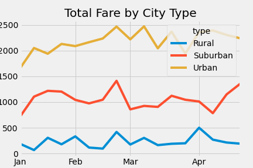
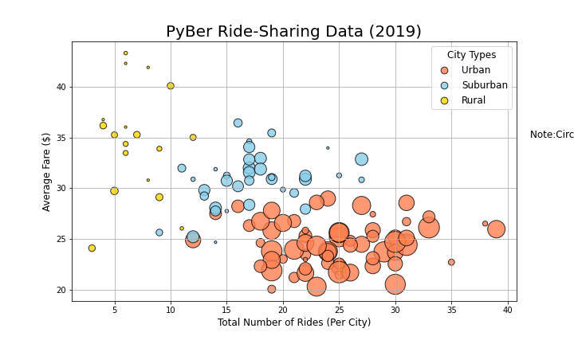

# PyBer_Analysis
# Overview of Analysis
The purpose of this analysis was to provide ride-sharing data based on city type. In the analysis, I was able to identify the total fare by city type based on date. 

## Results
The results of the analysis show that Urban cities had higher fare values than Suburban and Urban cities. As you can see in the line graph below, the Rural cities had their highest fares in April. You can also see in the chart, that the highest fares were in February. The Rural city types had the lowest fare values. 

## Summary
 Based on the results, I would review the data for the months betweeen February and March. The total fare was the highest in these months, which could correlate to the weather. Additionally, more rides were taken in Urban city types, but the average fare was a lot higher in rural city types. Lastly, majority of the rides and drivers are in Urban cities. 
 
 
  
  
